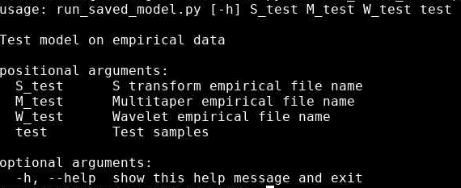

<div id="top"></div>
<!--
*** Thanks for checking out the Best-README-Template. If you have a suggestion
*** that would make this better, please fork the repo and create a pull request
*** or simply open an issue with the tag "enhancement".
*** Don't forget to give the project a star!
*** Thanks again! Now go create something AMAZING! :D
-->


<!-- PROJECT SHIELDS -->
<!--
*** I'm using markdown "reference style" links for readability.
*** Reference links are enclosed in brackets [ ] instead of parentheses ( ).
*** See the bottom of this document for the declaration of the reference variables
*** for contributors-url, forks-url, etc. This is an optional, concise syntax you may use.
*** https://www.markdownguide.org/basic-syntax/#reference-style-links
-->


<!-- PROJECT LOGO -->
<br />
<div align="center">
  <a href="https://github.com/sandipanpaul06/SISSSCO">
    
  </a>

  <h3 align="center">SISSSCO Documentation</h3>

  <p align="center">
    An AI based and signal processing empowered tool to find signatures of selective sweeps
    <br />
    <a href="https://github.com/othneildrew/Best-README-Template"><strong>Explore the docs »</strong></a>
    <br />
    <br />
    <a href="https://github.com/sandipanpaul06/SISSSCO/issues">Report Bug</a>
    ·
    <a href="https://github.com/sandipanpaul06/SISSSCO/issues">Request Feature</a>
  </p>
</div>


<!-- TABLE OF CONTENTS -->
<details>
  <summary>Table of Contents</summary>
  <ol>
    <li>
      <a href="#about-the-project">About The Project</a>
      <ul>
        <li><a href="#built-with">Built With</a></li>
      </ul>
    </li>
    <li>
      <a href="#getting-started">Getting Started</a>
      <ul>
        <li><a href="#prerequisites">Prerequisites</a></li>
        <li><a href="#installation">Installation</a></li>
      </ul>
    </li>
    <li><a href="#usage">Usage</a></li>
    <li><a href="#roadmap">Roadmap</a></li>
    <li><a href="#contributing">Contributing</a></li>
    <li><a href="#license">License</a></li>
    <li><a href="#contact">Contact</a></li>
    <li><a href="#acknowledgments">Acknowledgments</a></li>
  </ol>
</details>


<!-- ABOUT THE PROJECT -->
## About The Project

* Abstract: 

Natural selection leaves a spatial pattern along the genome, with a distortion in the haplotype distribution near the selected locus that becomes less prominent with increasing distance from the locus. Evaluating the spatial signal of a population-genetic summary statistic across the genome allows for patterns of natural selection to be distinguished from neutrality. Different summary statistics highlight diverse components of genetic variation and, therefore, considering the genomic spatial distribution of multiple summary statistics is expected to aid in uncovering subtle signatures of selection. In recent years, numerous methods have been devised that jointly consider genomic spatial distributions across summary statistics, utilizing both classical machine learning and contemporary deep learning architectures. However, better predictions may be attainable by improving the way in which features used as input to machine learning algorithms are extracted from these summary statistics. To achieve this goal, we apply three time-frequency analysis approaches (wavelet, multitaper, and S-transform analyses) to summary statistic signals. Each analysis method converts a one-dimensional summary statistic signal to a two-dimensional image of spectral density or visual representation of time-frequency analysis, permitting the simultaneous representation of temporal and spectral information. We use these images as input to convolutional neural networks and consider combining models across different time-frequency representation approaches through the ensemble stacking technique. Application of our modeling framework to data simulated from neutral and selective sweep scenarios reveals that it achieves almost perfect accuracy and power across a diverse set of evolutionary settings, including population size changes and test sets for which sweep strength, softness, and timing parameters were drawn from a wide range. Given that this modeling framework is also robust to missing data, we believe that it will represent a welcome addition to the population-genomic toolkit for learning about adaptive processes from genomic data.

<p align="right">(<a href="#top">back to top</a>)</p>


### Built With


* [![Python][Python.org]][Python-url]

<p align="right">(<a href="#top">back to top</a>)</p>


<!-- GETTING STARTED -->
## Getting Started


### Prerequisites

Python version 3.8.5 or above is necessary to use this software. Run the following commands to ensure you have the required version.
* set python3 as python
  ```sh
  alias python=python3
  ```
* check python3 version
  ```sh
  python --version
  ```

### Installation

Required python packages: pandas, tensorflow, numpy, PyWavelets, spectrum, stockwell

1. Clone the repo
   ```sh
   git clone https://github.com/sandipanpaul06/SISSSCO.git
   ```
3. Package installation
   ```sh
   pip install pandas numpy tensorflow PyWavelets spectrum stockwell
   ```
4. For the packages already installed, upgrade the packages to the most updated version. For example
   ```js
   pip install --upgrade tensorflow
   ```

<p align="right">(<a href="#top">back to top</a>)</p>


<!-- USAGE EXAMPLES -->
## Usage

1. Data preprocessing and model training:

* 1.1. Open terminal and go to SISSSCO software directory. Example:
   ```sh
   cd /Users/user/Desktop/SISSSCO
   ```

* 1.2. .ms output fles:

* 1.2.1. The .ms files are located in "Datasets" folder in the SISSSCO software directory. For example:
   ```sh
   /Users/user/Desktop/SISSSCO/Datasets
   ```
* 1.2.2. The "Datasets" folder has two sub-folders: "Neutral" and "Sweep". The neutral .ms files need to be placed in the "Neutral" folder, and the sweep .ms files need to be placed in the "Sweep" folder.

* 1.2.3. 100 sample files each can be found in the "Neutral" and "Sweep" subfolders. These files can be accessed by (example directory):
   ```sh
   /Users/user/Desktop/SISSSCO/Datasets/Neutral
   ```
   ```sh
   /Users/user/Desktop/SISSSCO/Datasets/Sweep
   ```
* 1.2.4. The sweep .ms files have a prefix "CEU_sweep", and the neutral .ms files have a prefix "CEU_neut", followed by consecutive numbers from 1 to 100. Example:
   ```sh
   CEU_sweep_1.ms, CEU_sweep_2.ms ... CEU_sweep_100.ms
   ```
   ```sh
   CEU_neut_1.ms, CEU_neut_2.ms ... CEU_neut_100.ms
   ```

* 1.3. Run sum_stat_ms.py to generate summary statistics:

* 1.3.1. Command to view the necessary arguments, run:
   ```sh
   python sum_stat_ms.py -h
   ```
<br />
<div align="center">
  <a href="https://github.com/sandipanpaul06/SISSSCO">
    
  </a>
</div>   

<p align="right">(<a href="#top">back to top</a>)</p>

* 1.3.2. pref: .ms file prefix, class_type: 1 for sweep or 0 for neutral, number: number of simulations (numbered consecutively starting from 1)

* 1.3.3. Example run with sample .ms files:

   ```sh
   sum_stat_ms.py CEU_neut 0 100
   ```
   ```sh
   sum_stat_ms.py CEU_sweep 1 100
   ```

* 1.3.4. Output file will be saved in "Summary_statistics" folder and output message will print the size of the dataset (number of qualified samples, 9 summary statistics * 128 windows):
   ```sh
   dataset shape :  (100, 1152)
   ```

   Sweep:
   ```sh
   dataset shape :  (100, 1152)
   ```


* 1.4. Run wavelet_decomposition.py to time-frequency imagee dataset for wavelet decomposition:

* 1.4.1. Constraint: the dataset shape of both neutral and sweep classes need to be the same. If not, the summary statistic dataset with higher number of qualified samples need to be resized to have the same size as the dataset with lower number of qualified samples.
   

* 1.4.2. To view the necessary arguments, run:
   ```sh
   python wavelet_decomposition.py -h
   ```
<br />
<div align="center">
  <a href="https://github.com/sandipanpaul06/SISSSCO">
    
  </a>
</div>   

<p align="right">(<a href="#top">back to top</a>)</p>

* 1.4.3. sweep_filename: name of the summary statistic file for class sweep, neutral_filename: name of the summary statistic file for class neutral, train = number of samples to be used for training, test = number of samples to be used for testing, val = number of samples to be used for validation. Train + Test + Val <= total number of samples in the summary statistic dataset. The same train, test and val must be used throughout the model training process.

* 1.4.4. Example run with sample summary statistic file:

   ```sh
   python wavelet_decomposition.py training_Sweep.csv training_Neutral.csv 60 20 20
   ```


* 1.4.5. Output files will be saved in "TFA" folder. The files are: standardized time-frequency image dataset (.npy), mean and standard deviation of the images (.npy), mean heatmap of the unstandardized and standardized images (.png).


* 1.5. Run multitaper_analysis.py to time-frequency imagee dataset for S transform:

* 1.5.1. Constraint: the dataset shape of both neutral and sweep classes need to be the same. If not, the summary statistic dataset with higher number of qualified samples need to be resized to have the same size as the dataset with lower number of qualified samples.
   

* 1.5.2. To view the necessary arguments, run:
   ```sh
   python s_transform.py -h
   ```
<br />
<div align="center">
  <a href="https://github.com/sandipanpaul06/SISSSCO">
    
  </a>
</div>   

<p align="right">(<a href="#top">back to top</a>)</p>

* 1.5.3. sweep_filename: name of the summary statistic file for class sweep, neutral_filename: name of the summary statistic file for class neutral, train = number of samples to be used for training, test = number of samples to be used for testing, val = number of samples to be used for validation. Train + Test + Val <= total number of samples in the summary statistic dataset. The same train, test and val must be used throughout the model training process.

* 1.5.4. Example run with sample summary statistic file:

   ```sh
   python s_transform.py training_Sweep.csv training_Neutral.csv 60 20 20
   ```


   iv. Output files will be saved in "TFA" folder. The files are: standardized time-frequency image dataset (.npy), mean and standard deviation of the images (.npy), mean heatmap of the unstandardized and standardized images (.png).


* 1.5. Run multitaper_analysis.py to time-frequency imagee dataset for S transform:

* 1.5.1. Constraint: the dataset shape of both neutral and sweep classes need to be the same. If not, the summary statistic dataset with higher number of qualified samples need to be resized to have the same size as the dataset with lower number of qualified samples.
   

* 1.5.2. To view the necessary arguments, run:
   ```sh
   python s_transform.py -h
   ```
<br />
<div align="center">
  <a href="https://github.com/sandipanpaul06/SISSSCO">
    
  </a>
</div>   

<p align="right">(<a href="#top">back to top</a>)</p>

* 1.5.3. sweep_filename: name of the summary statistic file for class sweep, neutral_filename: name of the summary statistic file for class neutral, train = number of samples to be used for training, test = number of samples to be used for testing, val = number of samples to be used for validation. Train + Test + Val <= total number of samples in the summary statistic dataset. The same train, test and val must be used throughout the model training process.

* 1.5.4. Example run with sample summary statistic file:

   ```sh
   python s_transform.py training_Sweep.csv training_Neutral.csv 60 20 20
   ```


* 1.5.5. Output files will be saved in "TFA" folder. The files are: standardized time-frequency image dataset (.npy), mean and standard deviation of the images (.npy), mean heatmap of the unstandardized and standardized images (.png).

* 1.6. Train and save the model:

* 1.6.1. To view the necessary arguments, run:
   ```sh
   python save_model.py -h
   ```

<br />
<div align="center">
  <a href="https://github.com/sandipanpaul06/SISSSCO">
    
  </a>
</div>   


* 1.6.2. Arguments are: train-test-validation split, training datasets for wavelet-multitaper-stockwell, testing datasets for wavelet-multitaper-stockwell, validation datasets for wavelet-multitaper-stockwell, and train-test-validation label files.

* 1.6.3. Example run with sample file:

   ```sh
   python save_model.py 60 20 20 X_train_wavelet.npy X_train_multitaper.npy X_train_stockwell.npy X_test_wavelet.npy X_test_multitaper.npy X_test_stockwell.npy X_val_wavelet.npy X_val_multitaper.npy X_val_stockwell.npy Y_train.npy Y_test.npy Y_val.npy
   ```


* 1.6.4. Model will be saved as "saved_model", and test dataset predictions will be saved as "test_prediction.csv" in the SISSSCO software directory. 


2. Model testing:

* 2.1. Parsing a VCF file:

* 2.1.1 To view the necessary arguments, run:
   ```sh
   python VCF_parser.py -h
   ```
   
<br />
<div align="center">
  <a href="https://github.com/sandipanpaul06/SISSSCO">
    
  </a>
</div>   


* 2.1.2. Arguments are: name of the vcf file

* 2.1.3.  Example run with sample file:

   ```sh
   python VCF_parser.py CEU22.vcf
   ```

* 2.1.4 Output (.npy) will be saved in "Parsed_vcf" folder.


* 2.2. Geneate summary statistics from parsed vcf file:

* 2.2.1 To view the necessary arguments, run:
   ```sh
   python sum_stat_vcf.py -h
   ```

<br />
<div align="center">
  <a href="https://github.com/sandipanpaul06/SISSSCO">
    
  </a>
</div>   

<p align="right">(<a href="#top">back to top</a>)</p>

* 2.2.2. Arguments are: name of the parsed vcf file

* 2.2.3.  Example run with sample file:

   ```sh
   python sum_stat_vcf.py parsed_CEU22.vcf
   ```

* 2.2.4 Output will be saved in "Summary_statistics" folder. Please note down the number of qualified samples from the shape of the file as discussed in 1.3.4.


* 2.3 Generate time-frequency images: Same as 1.4, 1.5, 1.6

* 2.4 Run save_model.py to get the empirical prediction:

  * 2.4.1 To view the necessary arguments, run:
   ```sh
   python save_model.py -h

<br />
<div align="center">
  <a href="https://github.com/sandipanpaul06/SISSSCO">
    
  </a>
</div>  

  * Arguments are: wavelet, multitaper and stockwell image datasets and number of qualified samples from 2.2.4
  * Predictions will be saved as "test_prediction.csv" in the SISSSCO software directory. 


<!-- LICENSE -->
## License

Distributed under the MIT License. See `LICENSE.txt` for more information.

<p align="right">(<a href="#top">back to top</a>)</p>


<!-- CONTACT -->
## Contact

Sandipan Paul Arnab - sarnab2020@fau.edu


<p align="right">(<a href="#top">back to top</a>)</p>


<!-- ACKNOWLEDGMENTS -->
## Acknowledgments

Use this space to list resources you find helpful and would like to give credit to. I've included a few of my favorites to kick things off!


<p align="right">(<a href="#top">back to top</a>)</p>


<!-- MARKDOWN LINKS & IMAGES -->
<!-- https://www.markdownguide.org/basic-syntax/#reference-style-links -->
[contributors-shield]: https://img.shields.io/github/contributors/othneildrew/Best-README-Template.svg?style=for-the-badge
[contributors-url]: https://github.com/othneildrew/Best-README-Template/graphs/contributors
[forks-shield]: https://img.shields.io/github/forks/othneildrew/Best-README-Template.svg?style=for-the-badge
[forks-url]: https://github.com/othneildrew/Best-README-Template/network/members
[stars-shield]: https://img.shields.io/github/stars/othneildrew/Best-README-Template.svg?style=for-the-badge
[stars-url]: https://github.com/othneildrew/Best-README-Template/stargazers
[issues-shield]: https://img.shields.io/github/issues/othneildrew/Best-README-Template.svg?style=for-the-badge
[issues-url]: https://github.com/othneildrew/Best-README-Template/issues
[license-shield]: https://img.shields.io/github/license/othneildrew/Best-README-Template.svg?style=for-the-badge
[license-url]: https://github.com/othneildrew/Best-README-Template/blob/master/LICENSE.txt
[linkedin-shield]: https://img.shields.io/badge/-LinkedIn-black.svg?style=for-the-badge&logo=linkedin&colorB=555
[linkedin-url]: https://linkedin.com/in/othneildrew
[product-screenshot]: images/screenshot.png
[Python.org]: https://data-science-blog.com/wp-content/uploads/2022/01/python-logo-header-1030x259.png
[Python-url]: https://www.python.org/
[React.js]: https://img.shields.io/badge/React-20232A?style=for-the-badge&logo=react&logoColor=61DAFB
[React-url]: https://reactjs.org/
[Vue.js]: https://img.shields.io/badge/Vue.js-35495E?style=for-the-badge&logo=vuedotjs&logoColor=4FC08D
[Vue-url]: https://vuejs.org/
[Angular.io]: https://img.shields.io/badge/Angular-DD0031?style=for-the-badge&logo=angular&logoColor=white
[Angular-url]: https://angular.io/
[Svelte.dev]: https://img.shields.io/badge/Svelte-4A4A55?style=for-the-badge&logo=svelte&logoColor=FF3E00
[Svelte-url]: https://svelte.dev/
[Laravel.com]: https://img.shields.io/badge/Laravel-FF2D20?style=for-the-badge&logo=laravel&logoColor=white
[Laravel-url]: https://laravel.com
[Bootstrap.com]: https://img.shields.io/badge/Bootstrap-563D7C?style=for-the-badge&logo=bootstrap&logoColor=white
[Bootstrap-url]: https://getbootstrap.com
[JQuery.com]: https://img.shields.io/badge/jQuery-0769AD?style=for-the-badge&logo=jquery&logoColor=white
[JQuery-url]: https://jquery.com 